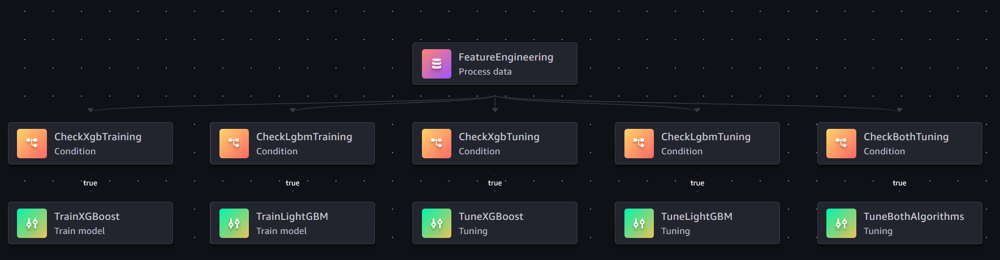

# Loan Default Prediction on Amazon SageMaker

End-to-end ML workflow for **loan default prediction** using Amazon SageMaker, covering synthetic data generation, distributed feature engineering, model training (XGBoost and LightGBM), hyperparameter tuning, and repeatable MLOps pipelines.

## Repository Structure

```
data-processing/
├── loan_ml_pipeline_walkthrough.ipynb   # Interactive walkthrough (start here)
├── pipeline_config.yaml                 # Shared config for all pipelines/scripts
├── pipeline_fe_training.py              # SageMaker Pipeline: FE -> Training/Tuning
├── pipeline_training.py                 # SageMaker Pipeline: Training/Tuning only
├── generate_loan_data.py                # Synthetic loan data generator (10M+ rows)
├── launch_scripts/                      # Standalone launchers (same functionality as notebook)
│   ├── launch_sagemaker_job.py          #   Feature engineering processing job
│   ├── launch_training_dist_job.py      #   Distributed XGBoost training job
│   ├── launch_training_dist_lgbm_job.py #   Distributed LightGBM training job
│   └── launch_hpo_job.py               #   Multi-algorithm hyperparameter tuning job
├── src/                                 # Feature engineering source (uploaded to SageMaker)
│   ├── sagemaker_run.py                 #   Entry point — bootstraps Ray cluster
│   ├── feature_engineering.py           #   9-stage Ray Data pipeline (cleaning, 41 features, train/val split)
│   └── requirements.txt
├── src_dist_training/                   # XGBoost training source
│   ├── sagemaker_train.py               #   Entry point — Ray cluster bootstrap + training dispatch
│   ├── train_xgboost_dist.py            #   Core XGBoost logic (Ray Train DataParallelTrainer)
│   └── requirements.txt
├── src_dist_training_lgbm/              # LightGBM training source
│   ├── sagemaker_train.py               #   Entry point — Ray cluster bootstrap + training dispatch
│   ├── train_lightgbm_dist.py           #   Core LightGBM logic (Ray Train, data-parallel tree learner)
│   └── requirements.txt
├── model/                               # Downloaded model artifacts (local testing)
└── images/                              # Pipeline diagrams
```

## Quick Start

### Prerequisites

- SageMaker environment (Studio, notebook instance, or local with valid credentials)
- IAM role with SageMaker and S3 permissions
- Python 3.12+
- SageMaker SDK v2:
  ```bash
  pip install sagemaker==2.245.0
  ```

### Option 1: Interactive Notebook

Open `loan_ml_pipeline_walkthrough.ipynb` and follow the sections in order. The notebook covers every step with explanations of SageMaker SDK concepts and includes code to download and test model artifacts locally.

### Option 2: CLI Scripts

The `launch_scripts/` directory provides the same functionality as the notebook via standalone Python scripts. All scripts use `argparse` with sensible defaults — run any with `--help` for full options.

```bash
# 1. Generate synthetic data
python generate_loan_data.py --rows 10000000 --format csv --output raw_loan_data.csv

# 2. Run feature engineering
python launch_scripts/launch_sagemaker_job.py --instance-count 2 --wait

# 3. Train models
python launch_scripts/launch_training_dist_job.py --wait       # XGBoost
python launch_scripts/launch_training_dist_lgbm_job.py --wait  # LightGBM

# 4. Hyperparameter tuning (both algorithms simultaneously)
python launch_scripts/launch_hpo_job.py --max-jobs 20 --wait
```

### Option 3: SageMaker Pipelines

Pipelines stitch the steps into a repeatable, parameterized DAG. All defaults come from `pipeline_config.yaml`.

```bash
# Full pipeline: Feature Engineering -> Training/Tuning
python pipeline_fe_training.py --start

# Training only (assumes FE data already exists in S3)
python pipeline_training.py --start
```

Override any parameter at runtime:

```bash
# Train XGBoost only
python pipeline_fe_training.py --start --params AlgorithmChoice=xgboost

# Tune both algorithms (multi-algorithm HPO)
python pipeline_fe_training.py --start --params RunTuning=true

# Tune a single algorithm
python pipeline_fe_training.py --start --params RunTuning=true AlgorithmChoice=lightgbm

# Custom hyperparameters
python pipeline_fe_training.py --start --params XgbLearningRate=0.05 NumRounds=1000
```

## Pipeline Architecture



### Pipeline Graph (FE -> Training)

```
FeatureEngineering (ProcessingStep)
    |
    ├── CheckXgbTraining   -> TrainXGBoost          (algo in [xgboost,both] AND tuning=false)
    ├── CheckLgbmTraining  -> TrainLightGBM         (algo in [lightgbm,both] AND tuning=false)
    ├── CheckXgbTuning     -> TuneXGBoost           (algo == xgboost AND tuning=true)
    ├── CheckLgbmTuning    -> TuneLightGBM          (algo == lightgbm AND tuning=true)
    └── CheckBothTuning    -> TuneBothAlgorithms    (algo == both AND tuning=true)
```

Training and tuning are **mutually exclusive** — setting `RunTuning=true` disables training and vice versa. When `AlgorithmChoice=both` with tuning enabled, a single multi-algorithm tuner searches across both XGBoost and LightGBM simultaneously, ranking all trials by the shared objective metric.

### Configuration

`pipeline_config.yaml` has two categories of settings:

| Category | Examples | When changes take effect |
|----------|----------|--------------------------|
| **Baked at creation time** | `source_dir`, `entry_point`, `tuning_ranges`, `framework_version` | Re-run `pipeline_fe_training.py` to rebuild |
| **Overridable at execution** | Everything in `parameters:` | Pass `--params Key=Value` or use SageMaker console |

## Synthetic Data

`generate_loan_data.py` creates realistic loan data with intentional quality issues:

- **Missing values** -- MCAR, MAR, and MNAR patterns (3-8% per column)
- **String inconsistencies** -- mixed casing, typos, synonyms (e.g. `"Married"`, `"MARRIED"`, `"Maried"`)
- **Numeric outliers** -- impossible ages, credit scores outside valid range
- **Mixed date formats** -- `YYYY-MM-DD`, `MM/DD/YYYY`, `DD-MM-YYYY`, plus garbage values
- **Duplicate rows** -- ~1% injected per chunk
- **Imbalanced target** -- ~15% Default, ~77% Paid, ~8% Current

Uses vectorized NumPy and multiprocessing for scale (100M+ rows).

## Training Details

Both algorithms use [Ray Train](https://docs.ray.io/en/latest/train/train.html) for distributed training inside a PyTorch SageMaker container. The PyTorch container is used not for PyTorch itself, but for its well-maintained Python/pip environment where Ray, XGBoost, and LightGBM are installed via `requirements.txt`.

| | XGBoost | LightGBM |
|---|---------|----------|
| **Distribution** | Rabit AllReduce via Ray | `tree_learner="data_parallel"` via Ray |
| **Tunable HPs** | 5 (learning-rate, max-depth, subsample, colsample-bytree, min-child-weight) | 6 (same + num-leaves) |
| **Objective examples** | `binary:logistic`, `multi:softmax`, `reg:squarederror` | `binary`, `multiclass`, `regression` |
| **Source directory** | `src_dist_training/` | `src_dist_training_lgbm/` |

## Hyperparameter Tuning

Three tuning modes:

1. **Single-algorithm** -- Tune XGBoost or LightGBM independently (`AlgorithmChoice=xgboost` or `lightgbm` with `RunTuning=true`)
2. **Multi-algorithm** -- Tune both simultaneously in one job (`AlgorithmChoice=both` with `RunTuning=true`). Uses `HyperparameterTuner.create()` to search across both algorithms, allocating the job budget across them and ranking all trials by the shared objective metric.
3. **Standalone script** -- `launch_scripts/launch_hpo_job.py` runs multi-algorithm tuning outside the pipeline

Tuning ranges are defined in `pipeline_config.yaml` under `tuning_ranges:` and are baked at pipeline creation time.
